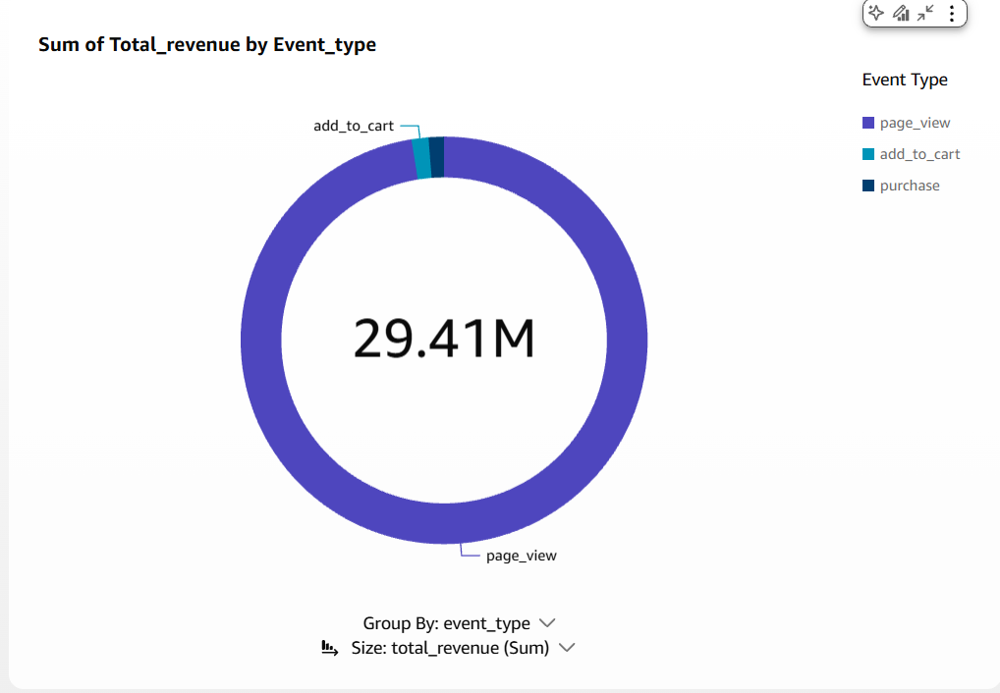
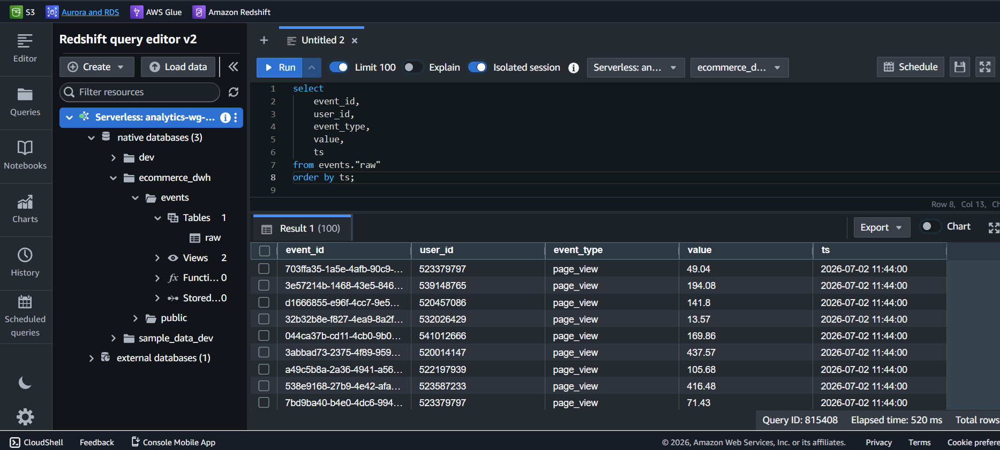

# Real-Time E-Commerce Analytics Pipeline

AWS streaming pipeline processing 42M+ events using Kinesis → Lambda → Redshift Serverless → QuickSight. End-to-end latency under 30 seconds.

## Architecture
Kinesis Data Streams → Lambda → Redshift Serverless
                              → Firehose → S3

## Stack
- Kinesis Data Streams
- AWS Lambda (Python 3.11)
- Redshift Serverless
- Kinesis Firehose
- S3
- API Gateway
- Terraform (IaC)
- QuickSight

## QuickSight Chart

## Redshift Query

## Setup
1. Copy `terraform/envs/dev.tfvars.example` to `terraform/envs/dev.tfvars` and fill in your values
2. Run `make init`
3. Run `make up-storage`
4. Run `make up-compute`